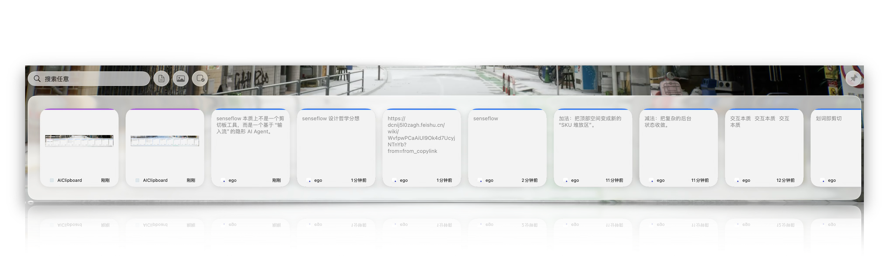

# SenseFlow

> SenseFlow 不是剪贴板工具，而是一个基于"输入流"的隐形 AI Agent。




## 核心理念

我们利用"剪贴板"这一操作系统最底层的数据交换口，构建一个低用户可见面的智能体：

- **输入端**：捕捉用户的瞬间意图（划词 / 复制）
- **处理端**：后台 AI 转化信息，避免中转 chatbot GUI
- **输出端**：以最小打扰的方式交付结果（粘贴 / 替换）

### 设计哲学：低 SKU，避免功能腐败

借用零售业的隐喻 —— 商品 SKU 低 = 买手替用户做选择；功能 SKU 低 = 产品替用户做选择。

- **暴露选项是开发者的懒惰**，我们替用户做好选择
- **把复杂留在内部**，配置项压到最少
- **克制而非焦虑** —— 像 iOS 灵动岛一样收敛状态，而非堆砌入口

## 功能特性

- 🎯 **自动捕获**: 后台自动保存剪贴板历史（文本、图片）
- ⌨️ **快捷键呼出**: `Cmd+Option+V` 快速呼出历史窗口（可自定义）
- 🎨 **横向卡片**: 底部悬浮窗 + Liquid Glass 效果 + 横向滚动
- 🔍 **智能搜索**: 实时搜索文本、应用名称、图片内容（OCR）
- 🔑 **快捷键自定义**: 自定义全局快捷键，实时冲突检测
- 🗑️ **删除功能**: 卡片悬停删除按钮 + 清空历史
- 🖼️ **图片 OCR**: 自动识别图片文字，支持搜索图片内容
- ⚙️ **设置面板**: 快捷键/历史上限/自启动/应用过滤
- 🚀 **自动粘贴**: 点击卡片自动粘贴到目标应用（可选）
- 🔒 **隐私保护**: 自动过滤密码管理器 + 自定义应用过滤列表
- 💾 **智能存储**: SQLite 数据库，支持 50-500 条历史记录，自动去重
- ⚡ **高性能**: CPU 占用 < 0.1%，流畅 60fps 动画
- ✨ **Smart AI**: 划词触发意图识别，自动推荐最匹配的 Prompt Tool

## 两大核心能力

### Memory：从碎片到上下文

- 剪贴板自动捕获（文本、图片）
- 底部悬浮窗 + Liquid Glass 效果 + 横向卡片浏览
- 实时搜索 + 图片 OCR 文本搜索
- 自动粘贴（一键回到目标应用）
- 敏感数据自动过滤

### Skill：Smart AI 意图识别

- 划词 / 复制触发 Smart AI
- AX Tree 实时覆盖截图 + 全屏截图，构建上下文
- 系统 Prompt + 用户 Prompt + 截图 → LLM 意图识别
- 基于光标位置的局部意图推断，自动推荐最匹配的 Prompt Tool

## 安装

从 [Releases](https://github.com/CyberDoctor2023/senseflow/releases) 下载最新 DMG：

1. 打开 DMG，将 `SenseFlow.app` 拖入 `/Applications`
2. 首次打开：右键 → 打开（未签名应用）
3. 授予 Accessibility 权限（用于自动粘贴，可选）

**系统要求**：macOS 14.0+，Apple Silicon（M1/M2/M3/M4）

## 使用

1. **启动应用** - 应用会在后台自动运行（菜单栏图标）
2. **复制内容** - 复制任意文本或图片
3. **呼出窗口** - 按 `Cmd+Option+V`（可在设置中自定义）
4. **搜索内容** - 输入关键词搜索文本、应用名称、图片内容
5. **选择内容** - 点击卡片
6. **自动粘贴** - 内容自动粘贴到目标应用（需授权）
7. **Smart AI** - 划词后按快捷键，AI 自动识别意图并处理
8. **打开设置** - 菜单栏 → 设置（Cmd+,）

## 技术栈

- **UI 框架**: SwiftUI + AppKit（窗口管理）
- **视觉效果**: Liquid Glass（macOS 26 `.glassEffect()`）
- **数据库**: [SQLite.swift](https://github.com/stephencelis/SQLite.swift)
- **剪贴板**: NSPasteboard API
- **快捷键**: Carbon EventHotKey API
- **自动粘贴**: CGEvent（需要 Accessibility 权限）
- **OCR 识别**: Vision Framework (VNRecognizeTextRequest)
- **AI 服务**: OpenAI / Gemini API
- **开机自启**: SMAppService (macOS 13+)

## 架构设计

本项目采用 **Clean Architecture**（整洁架构），实现业务逻辑与框架解耦，提高可测试性和可维护性。

### 架构层次（依赖方向：外层 → 内层）

```
┌─────────────────────────────────────────────────────────┐
│  Presentation Layer (表现层)                             │
│  SwiftUI Views + @EnvironmentObject                     │
└─────────────────────────────────────────────────────────┘
                        ↓ 调用
┌─────────────────────────────────────────────────────────┐
│  Coordinator Layer (协调器层)                            │
│  协调多个 Use Case，处理 UI 请求                          │
└─────────────────────────────────────────────────────────┘
                        ↓ 调用
┌─────────────────────────────────────────────────────────┐
│  Use Case Layer (用例层)                                 │
│  实现业务场景，编排服务                                    │
└─────────────────────────────────────────────────────────┘
                        ↓ 依赖
┌─────────────────────────────────────────────────────────┐
│  Port Layer (端口层 - 接口定义)                           │
│  定义业务逻辑需要的能力                                    │
└─────────────────────────────────────────────────────────┘
                        ↑ 实现
┌─────────────────────────────────────────────────────────┐
│  Adapter Layer (适配器层 - 接口实现)                      │
│  将外部框架适配到接口                                      │
└─────────────────────────────────────────────────────────┘
                        ↓ 调用
┌─────────────────────────────────────────────────────────┐
│  Infrastructure Layer (基础设施层)                        │
│  外部框架和系统 API                                        │
└─────────────────────────────────────────────────────────┘
```

**核心原则**:
- **依赖倒置**: 业务逻辑依赖接口，不依赖具体实现
- **单一职责**: 每个类只有一个变化原因
- **接口隔离**: 小而专注的接口定义
- **依赖注入**: 通过构造器注入依赖，便于测试

## 项目结构

```
SenseFlow/
├── Domain/                              # 领域层（核心业务规则）
│   ├── Protocols/                       # 接口定义（Port）
│   │   ├── AIServiceProtocol.swift      # AI 服务接口
│   │   ├── ClipboardReader.swift        # 剪贴板读取接口
│   │   ├── ClipboardRepository.swift    # 剪贴板仓库接口
│   │   ├── HotKeyRegistry.swift         # 快捷键注册接口
│   │   ├── NotificationServiceProtocol.swift  # 通知服务接口
│   │   └── PromptToolRepository.swift   # 工具仓库接口
│   ├── ValueObjects/                    # 值对象
│   │   ├── ClipboardContent.swift       # 剪贴板内容
│   │   ├── KeyCombo.swift               # 快捷键组合
│   │   └── ToolID.swift                 # 工具 ID
│   └── Errors/                          # 领域错误
│       └── PromptToolError.swift        # 工具错误定义
├── UseCases/                            # 用例层（应用业务规则）
│   ├── PromptTool/                      # Prompt 工具用例
│   │   ├── ExecutePromptTool.swift      # 执行工具
│   │   └── RegisterToolHotKey.swift     # 注册快捷键
│   └── SmartAI/                         # Smart AI 用例
│       └── AnalyzeAndRecommend.swift    # 分析推荐
├── Coordinators/                        # 协调器层（编排用例）
│   ├── PromptToolCoordinator.swift      # 工具协调器
│   └── SmartToolCoordinator.swift       # Smart AI 协调器
├── Adapters/                            # 适配器层（接口实现）
│   ├── Services/                        # 服务适配器
│   │   ├── OpenAIServiceAdapter.swift   # OpenAI 适配器
│   │   ├── NSPasteboardAdapter.swift    # 剪贴板适配器
│   │   ├── UserNotificationAdapter.swift # 通知适配器
│   │   ├── CarbonHotKeyAdapter.swift    # 快捷键适配器
│   │   └── SystemContextCollector.swift # 系统上下文收集
│   └── Repositories/                    # 仓库适配器
│       └── SQLitePromptToolRepository.swift  # SQLite 仓库
├── Infrastructure/                      # 基础设施层
│   └── DI/                              # 依赖注入
│       ├── DependencyContainer.swift    # DI 容器
│       ├── DependencyEnvironment.swift  # 环境对象
│       └── AppDependencies.swift        # 应用依赖
├── Managers/                            # 管理器模块（遗留代码）
│   ├── DatabaseManager.swift            # 数据库管理
│   ├── FloatingWindowManager.swift      # 悬浮窗管理
│   ├── HotKeyManager.swift              # 全局快捷键
│   ├── HotKeyPreferences.swift          # 快捷键配置
│   ├── AccessibilityManager.swift       # 权限管理
│   ├── AutoPasteManager.swift           # 自动粘贴
│   ├── BlobFileManager.swift            # 文件管理
│   ├── KeychainManager.swift            # 钥匙串管理
│   └── ScreenCaptureManager.swift       # 截图管理
├── Models/                              # 数据模型
│   ├── ClipboardItem.swift              # 剪贴板项模型
│   ├── ClipboardItemType.swift          # 类型枚举
│   ├── PromptTool.swift                 # Prompt 工具模型
│   └── SmartContext.swift               # Smart AI 上下文
├── Services/                            # 服务层
│   ├── ClipboardMonitor.swift           # 剪贴板监听
│   ├── AppIconCache.swift               # 应用图标缓存
│   ├── OCRService.swift                 # OCR 文字识别
│   └── AIService.swift                  # AI 服务（遗留）
├── Views/                               # 视图层
│   ├── ClipboardListView.swift          # 列表视图
│   ├── ClipboardCardView.swift          # 卡片视图
│   ├── VisualEffectView.swift           # 毛玻璃效果
│   ├── HotKeyRecorderView.swift         # 快捷键录制器
│   ├── SettingsView.swift               # 设置主视图
│   ├── PromptTools/                     # Prompt 工具视图
│   │   ├── PromptToolsView.swift        # 工具列表
│   │   └── PromptToolEditorView.swift   # 工具编辑器
│   └── Settings/                        # 设置子视图
│       ├── GeneralSettingsView.swift    # 通用设置
│       ├── ShortcutSettingsView.swift   # 快捷键设置
│       └── PrivacySettingsView.swift    # 隐私设置
├── AppDelegate.swift                    # 应用入口
├── main.swift                           # 主函数
└── Info.plist                           # 应用配置
```

## 功能详解

### 剪贴板自动捕获

- **支持类型**: 纯文本、图片（PNG、JPEG、TIFF）
- **轮询间隔**: 0.75 秒（低 CPU 占用）
- **去重机制**: SHA256 哈希，相同内容不重复存储
- **敏感过滤**: 自动过滤密码管理器数据（1Password、Bitwarden）
- **大文件处理**: 图片 >512KB 时分离存储
- **存储上限**: 200 条记录，FIFO 自动删除旧记录

### 历史窗口

- **位置**: 屏幕底部居中，距底部 20pt
- **样式**: Liquid Glass 毛玻璃背景
- **尺寸**: 自适应宽度，高度 300pt
- **动画**: 弹簧效果显示（0.4s），淡出隐藏（0.3s）
- **触发**: 快捷键、失焦自动隐藏

### 卡片展示

- **布局**: 横向滚动，最新记录在左侧
- **卡片尺寸**: 160 × 200pt，圆角 10pt
- **色条**: 文本蓝色 (#007AFF)，图片紫色 (#AF52DE)
- **交互**: 悬停放大 1.05x，点击写入剪贴板
- **时间标签**: 相对时间（刚刚、5分钟前、2小时前）

### 自动粘贴（可选）

- **实现方式**: 模拟 Cmd+V 按键（CGEvent）
- **焦点管理**: 自动切换回前一个应用
- **延迟优化**: 0.3 秒延迟，确保焦点切换
- **权限要求**: Accessibility 权限（首次使用时提示）
- **降级方案**: 未授权时手动粘贴

## 权限说明

### Accessibility 权限（可选）

**用途**: 实现自动粘贴功能

**授权方式**:
1. 点击卡片时弹出权限提示
2. 点击"打开系统设置"
3. 在"隐私与安全性" → "辅助功能"中勾选 SenseFlow

**不授权的影响**: 需手动按 Cmd+V 粘贴，其他功能正常使用

## 性能指标

| 指标 | 数值 |
|------|------|
| CPU 占用（后台） | < 0.1% |
| 内存占用（200 条记录） | < 100MB |
| 数据库查询速度 | < 50ms |
| 窗口动画帧率 | 60fps |

## 开发

```bash
# 克隆项目
git clone https://github.com/CyberDoctor2023/senseflow.git
cd senseflow

# 用 Xcode 打开
open SenseFlow.xcodeproj

# 构建 Release
xcodebuild -project SenseFlow.xcodeproj \
  -scheme SenseFlow \
  -configuration Release \
  -arch arm64 \
  clean build
```

## 开发进度

**v0.1** - 基础功能（剪贴板捕获、悬浮窗、快捷键、自动粘贴）

**v0.2** - 增强功能（搜索、OCR、快捷键自定义、设置面板）

**v0.3** - Prompt Tools（工具管理、快捷键绑定、AI 文本处理）

**v0.4** - Clean Architecture 重构（领域层、用例层、适配器层、DI、单元测试）

**v0.5** - Smart AI（AX Tree 截图、意图识别、Liquid Glass、Langfuse 可观测性）

## 已知问题

1. **设置面板需要 macOS 13.0+**: 低版本系统会提示升级

## 致谢

- [Maccy](https://github.com/p0deje/Maccy) - 剪贴板监听、数据存储参考
- [SQLite.swift](https://github.com/stephencelis/SQLite.swift) - Swift 数据库封装

## 许可证

Copyright © 2026 Jack. All rights reserved.
