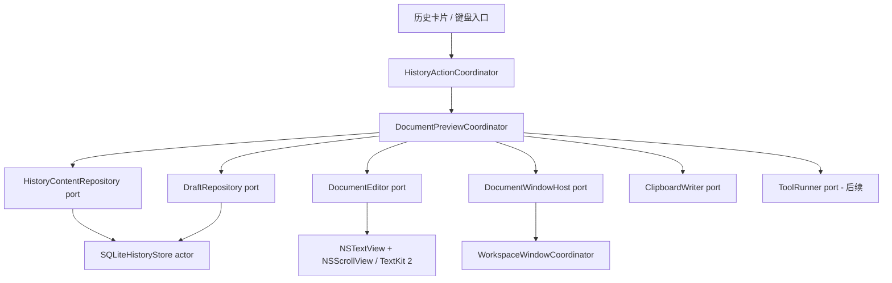
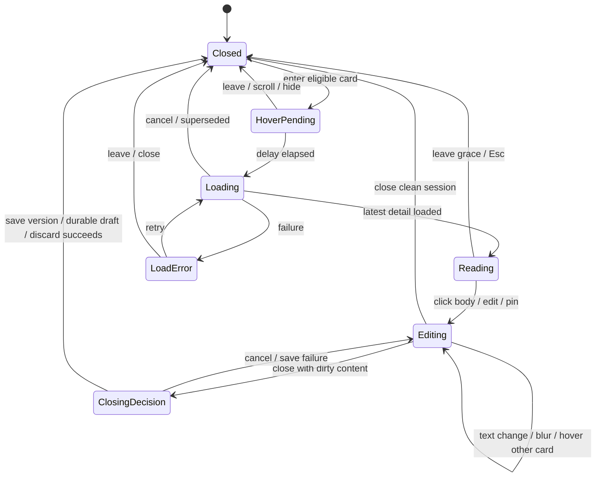

## 2026-10-07 滚动视口覆盖背景宽度

移除 ScrollView 外侧水平 padding，改用 contentMargins(horizontal, contentInset, for: scrollContent)。默认首尾卡片仍保留28pt内容边距，滚动视口延伸至背景边缘，消除在内缩28pt处的硬裁切；保留系统滚动/回弹。更新既有多显示器几何验收：卡片初始边距28pt，视口边距0。验证 focused build、既有真实 AppKit 视口/原生滚动验证；视觉体验待实机。

## 2026-10-07 点击预览外部收回

预览打开时，左键点击预览面板以外（包括历史卡片间隙与背景）触发统一动画关闭，不依赖 keyWindow 改变。左键原事件继续交付，卡片填入、搜索、Pin 等仍可操作；预览内部左键用于编辑，不关闭。右键任意位置关闭保持；脏草稿先 checkpoint，IME 和保存失败保护保持。验证真实 AppKit 背景左键事件和已有工作流，物理间隙点击需体验。

## 2026-10-07 列表阴影裁切修正

用户确认两侧竖矩形来自卡片阴影被视口裁切。移除列表卡片额外 shadow，保留原生玻璃、中心悬停/按压缩放、独立预览阴影及原生滚动/拖动。验证 focused build 和修改范围审查；边缘外观以实际体验验收，不新增单元测试。

## 2026-10-07 恢复原生拖动

按用户要求撤回实时玻璃浮层，仅恢复原生整卡拖动与系统取消回位；其他交互保持。验证 focused build 与原实现一致性，不新增测试。

# 长文本文档窗口：解耦与实现设计

## 2026-10-07 拖动与 Pin 解耦

CardPointerRegion 不再接收 isLocked，也不在 SwiftUI 更新时因未锁定而取消 dragTask。位移阈值和载荷加载后的有效性只检查左键、可见窗口、取消状态；复用完整卡片拖动图像和原生回位 session。HistoryActionCoordinator 仅记录原生 drag session 生命周期，FloatingWindowManager 的失焦隐藏在该期间暂停，结束回调重新判断实际焦点，不把临时拖动变成 Pin。Pin 列表锁定由原模型处理，完全独立；没有新增另一份内容缓存。

## 2026-10-07 原生历史滚动

移除 wheelPull、edgePull、自绘阻力、releaseTimer 和 SwiftUI spring 回位。输入适配只复制 CGEvent 并转换竖/横 delta 轴，原始 phase/momentum/continuous 字段不改；零 delta 结束事件也传给 NSScrollView。普通行滚轮由 horizontalLineScroll=24 转为像素步长，精确滚动由 AppKit 处理。原生 NSScrollView 查找使用窗口坐标的视口矩形，避免对 flipped NSHostingView 直接用 event.locationInWindow 做 hitTest；不依赖私有类名。禁止竖向弹性/滚动条，隐藏滚动背景与 border，水平回弹系统负责；SwiftUI 横向边缘效果仍隐藏。验证真实历史 NSScrollView 的位移和事件结束字段保留，硬件动画尚需体验。

## 2026-10-07 全区域右键关闭

DocumentWindowHost 在表面可见时安装本地/全局 rightMouseDown monitor，关闭/隐藏时移除；仅本地关闭点击被消费，其他应用收到原事件。统一交给 DocumentPreviewCoordinator.dismissPointerPreview，取消在途候选，阅读直接播放收回动画，编辑先异步 checkpoint 并防重复请求。CardPointerRegion 在新长按前调用同一入口，不依赖多个本地 monitor 的调用顺序，避免关闭后同一事件又启动放大。保留 IME 组字和持久化失败保护。补现有 AppKit 工作流验证背景右键触发真实关闭动画状态，不新增一套单元测试。

## 2026-10-07 卡片中心缩放

将玻璃壳的真实尺寸与长按比例一起变化，而不是在完整玻璃效果之后仅施加渲染 transform；内层完整内容仍以 center 缩放，外层固定原始卡片尺寸并 center 对齐。NSView 指针区域挂在固定占位上，预览 anchor 仍取未扩张原始卡片，邻卡和背景不随长按重新排布。避免仅显式写 center 却继续沿用原有玻璃 transform 路径；原 scaleEffect 的默认锚点本来就是中心，具体平台视觉偏移仍需体验确认。

当前实现为末尾“最终独立Quick Look式悬浮预览”：历史几何固定，DocumentWindowHost独占预览NSPanel。先前inline尺寸联动已删除。

日期：2026-10-06。状态：第一阶段已落实；验证与剩余差距见 `../DOCUMENT_IMPLEMENTATION_VALIDATION_2026-10-06.md`。行为唯一合同：`../prd/LONG_TEXT_DOCUMENT_PREVIEW.md`；本文件定义实现边界，不另起一套产品行为。

## 设计目标与非目标

目标：hover 轻量打开，阅读→编辑平滑升级，编辑保持稳定文档身份；保存与草稿可恢复，原始捕获不被修改。历史列表、窗口焦点、原生文字编辑、持久化、工具执行能分别测试，避免互相调用 singleton。

非目标：重写全 App、docx/富文本引擎、自主 Agent、多个同步编辑窗口、云端草稿。只有文档实际进入编辑时才有一个草稿；这不是用影子状态桥接旧 UI，而是用户明确编辑产生的独立内容。

## 实施前落点与替换依据（历史审查）

- `Views/ClipboardCardView.swift:90` 只有 8 行 Text，onHover 仅变 scale。改为发送 hover/click/preview intent；卡片不创建窗口、不读取全文。
- `Views/ClipboardListView.swift:129–166` 当前直接写 NSPasteboard、调用 ClipboardMonitor/FloatingWindowManager/AutoPasteManager singleton。提取 HistoryActionCoordinator；hover 预览不走现有 select→paste 链路。
- `Managers/FloatingWindowManager.swift:203–220` 只将 A/B 历史面板识别为内部窗口；文档获得 key 会导致历史被 hide。焦点归属必须改成工作区合同，不能加一个 300 ms 延时补丁。
- `Models/ClipboardItem.swift` 混合全文/图片与 UI computed properties；历史摘要、原文 snapshot、编辑 session 分清消费面，不能让列表每次携带所有正文。
- `Domain/Protocols/ClipboardRepository*.swift` 合并后扩展为明确摘要/详情/save-derived 合同；已有历史保存、查重、裁剪走同一个 store owner。
- `Managers/DatabaseManager.swift` 无文本编辑版本/草稿合同，不能为了支持编辑再从窗口直接操纵其 db。

## 模块与依赖方向

箭头表示调用/依赖。Repository/editor/window/writer 都由 composition root 注入。Session 不引用 DatabaseManager.shared、NSPasteboard.general、FloatingWindowManager.shared；Store 不知道 hover/window/editor；WindowHost 不知道 SQL/provider；Editor bridge 不执行 save/AI。

初始拟定文件落点（实际实现以末尾实施决策和代码为准）：

| 模块 | 单一责任 | 禁止承担 |
|---|---|---|
| `Coordinators/DocumentPreviewCoordinator.swift` | 唯一 active session、候选取消、模式转换、保存编排 | SQL、AppKit 布局细节 |
| `Domain/Document/DocumentSnapshot.swift` | 完整不可变内容、原记录身份/revision | window frame、NSImage |
| `Domain/Document/DocumentEditingContracts.swift` | load/checkpoint/save outcome 与类型合同 | NSTextView/NSRange 暴露 |
| `Infrastructure/Document/DocumentDraftRepository.swift` | 草稿读写适配到 store | hover timer、光标控制 |
| `Views/Document/DocumentPreviewView.swift` | 来源/关闭/加载错误/必要保存状态 | 正文 full-string 双向 binding |
| `Views/Document/NativeDocumentEditor.swift` | NSTextView 生命周期、编辑事件与输入法 | 直接改数据库/剪贴板 |
| `Managers/Window/DocumentWindowHost.swift` | 创建/复用/定位文档窗口、关闭请求 | 草稿/版本保存策略 |
| `Managers/Window/WorkspaceWindowCoordinator.swift` | history/preview/editor 窗口归属与焦点策略 | 多份文档内容状态 |

不要在不必要的每层创建空协议；以上 ports 是线程边界、外部副作用或需故障注入的真实边界。UI event reducer 可是 Coordinator 内纯函数，不再派生一套独立 semantic/shadow run 状态。

## 内容与会话所有权

1. HistoryStore 是已提交原文/版本的唯一真源；历史摘要只含 itemID/contentRevision、有限 excerpt、来源/时间、truncation hint。
2. 文档 snapshot 由 async loadDetail 得到，绑定稳定 itemID/revision，不随最近列表数组替换而改变。
3. 打开阅读时 native buffer 载入 snapshot 一次；进入编辑后，唯一 live text buffer 是当前 native editor 的 NSTextStorage。SwiftUI 只观察 mode、dirty、saveState 等小型元信息，不每次按键复制全文到 @Published String，再写回 NSTextView。
4. Core/Coordinator 通过 DocumentEditor port 获取 checkpoint/snapshot，接收 editGeneration、IME composition 等事件；port 类型只用 Foundation 可传输值，AppKit range/selection 由 bridge 内部解释。不存在另一份持续同步的全量“编辑真源”。
5. durable draft 是定期 checkpoint，用于恢复，不能当 live buffer 推回覆盖用户输入。Undo/选区/滚动只归 native editor session；SwiftUI元数据更新不替换整段文本。
6. 会话 sourceSnapshot 保留加载基准，currentGeneration 为当前编辑序号；savedGeneration/persistedDraftGeneration 分别表示已归档/已 checkpoint。dirty 与保存状态从序号/内容验证派生，不靠三个独立布尔值互相猜测。

正文加载、后台序列化与 hashing 通过值快照，不跨 actor 传 NSTextView。原生 buffer 读取/修改在 MainActor；不要声称能把 AppKit 排版任意挪到后台。

## Ports 的具体合同（设计签名，非已实现 API）

| 操作 | 输入 | 输出/错误 | 线程与副作用 |
|---|---|---|---|
| `HistoryContentRepository.loadDetail` | itemID、预期 revision、requestID | 完整 snapshot / missing / changed / readFailure | Store actor；无 UI、无 recency 更新 |
| `HistoryContentRepository.saveDerived` | immutable text snapshot、sourceID?、saveRequestID | newID / reusedExistingID / unchanged / writeFailure | 单 store 事务；查重/插入/来源关联一致 |
| `DraftRepository.checkpoint` | sessionID、sourceID?、baseRevision、generation、text | committedGeneration / staleRejected / writeFailure | 串行/actor；较旧 generation 不覆盖新草稿 |
| `DraftRepository.recover` | sourceID 或 orphan draft sessionID | durable snapshot + generation / none / failure | 不自动覆盖原记录 |
| `DraftRepository.discard` | sessionID、expectedGeneration | discarded / changed / writeFailure | 显式用户意图，只删该草稿 |
| `DocumentEditor.loadSnapshot` | sessionID + snapshot | ready / error | MainActor；仅初始载入/明确恢复 |
| `DocumentEditor.snapshotForCommit` | sessionID、expectedGeneration | text+generation / composing / superseded | MainActor 快照，后台存储 |
| `DocumentWindowHost.present/update/close` | sessionID、mode、anchor、metadata | opened/focus/close-request events | MainActor；不负责存储 |
| `ClipboardWriter.writeText` | 明确复制的 text snapshot | write receipt / failure | 现有统一 writer，记录自触发 changeCount |

loadDetail 改 revision 时不偷偷载入另一版；当前原文 immutable，revision 表示记录/schema 内容版本，recency 更新不当作正文修改。保存请求必须 idempotent，重复点击/重试不能创建两条版本。

## 状态与事件

session 只存在于一个 DocumentPreviewCoordinator。pointer candidate 可以与 active session 并存，但不能替代已固定文档。

SaveState 是同一 session 的子状态（idle/checkpointing/saving/error），不另复制 Editing state；保存时仍允许阅读和输入。首次按下正文进入编辑，pin 仅固定窗口时可继续只读，不强制创建草稿；图中的 Editing 表示固定会话族，mode 再区分 pinned-reading/editable。

具体事件：pointerEntered(itemID, anchor)、pointerLeft(region)、historyScrolled、hoverDelayElapsed(requestID)、detailLoaded(requestID,snapshot)、editorActivated、textChanged(generation)、compositionBegan/Ended、saveRequested、checkpointCompleted(generation)、windowCloseRequested、workspaceDeactivated、sourceRemoved。

延迟 clock 可注入 deterministic clock 测试；timer/work task 归 Coordinator，cancel 必须废弃 requestID。取消失败/任务已返回时仍用 generation 检查，不能只依赖 Task.cancel。

## Hover 竞态与可达性

- 自动预览最多 1 个 pending load，只有当前 requestID 可以 attach native editor/create window。
- 卡片 anchor 使用统一屏幕坐标，屏幕 scale/visibleFrame 转换只在 WindowHost；跨 hover 通道由工作区 geometry policy 判断，不要每个卡片自行 Timer。
- 从卡片到窗口的 grace period、选取 drag、窗口进入 hover 都归同一个 owner。隐藏历史可关闭 transient preview；固定编辑不关。
- host仅扩展现有历史窗口高度，保持底边。卡片负责真实宽度/高度变化；编辑期间正文变化不自动调整几何。
- 如果已有固定会话：卡片 hover 不做正文 fetch；显式请求打开其他记录时走保存/保留草稿/放弃确认，不能再创建隐藏的第二编辑会话。

## 原生编辑与焦点实现

拟用 AppKit NSPanel（阅读时不抢 key，点击编辑时可 key）+ SwiftUI chrome + NSViewRepresentable 的 NSScrollView/NSTextView。优先显式 TextKit 2 配置；TextKit 2 availability 与当前目标版本可兼容，具体 initializer/properties 使用前再核验 SDK 签名。

Apple 已核验：NSTextView 提供 editable/selectable/undo/find/delegate；NSPanel.becomesKeyOnlyIfNeeded 控制按需 key；NSTextViewportLayoutController 管理 viewport 布局。不是只设这些属性就证明焦点与长文性能正确，需 integration/UI 验证。

- bridge Coordinator 接 NSTextViewDelegate，只向 session 发变化元信息；updateNSView 若 session/revision 未变，不执行 textView.string = fullText，不清 Undo stack/选区。
- marked text 时不更换 buffer、不强制快照提交；Cmd+S 等待 composition 提交或提示完成输入，不取消输入法。
- hover 阅读不开 first responder；点击正文后成为 first responder，标准 Cmd+A/C/X/V/Z/Shift+Z/F 交给原生 responder chain。命令路由按当前编辑上下文，避免历史面板的快捷键拦截它们。
- 文档搜索/选区保留；字体与布局参数更新不通过 reload 实现。初始化自动 smart quotes/dashes/text replacement 根据纯文本合同关闭，拼写选项不得擅自改写正文。
- 用 workspace window IDs/角色来判断内部焦点切换，替换目前 A/B 身份硬编码。外部失焦由 workspace 发语义事件，不直接由每个 window handler 决定全部 close。
- windowShouldClose 发 close request，未持久化草稿/dirty 时由 session 决策；拒绝关闭直到保存/放弃/保留草稿完成。禁止因 windowDidResignKey 直接释放编辑会话。

## 草稿与新版本存储

建议 schema 增加 `document_drafts`：session_id、source_item_id(nullable)、base_revision、edit_generation、text_content、updated_at；派生版本来源关系用独立 lineage 表或 nullable sourceID，实施时选定一个 schema，不重复存源全文。source 删除采用可空引用，不让级联删除悄悄丢编辑草稿。

旧 clipboard_history 原文、hash、ID 保留；saveDerived 与普通捕获共用 store、去重与 recency 规则。同内容复用记录：不能自动把既有独立记录改成某篇原文唯一子节点，来源关联应支持记录已有 provenance；本轮不做无限版本图 UI。

草稿 checkpoint：MainActor 取得 generation=N 的不可变 text 快照 → 后台写事务 → 返回 committed=N。若输入已到 N+1，成功回执只能更新 persistedGeneration=N，仍显示有待保存修改。每会话最多一个写入与一个合并的最新 pending snapshot；drop older checkpoint 是合并状态，不丢实际最新 draft。

保存版本：capture generation=N → 后台计算 hash/事务保存 → 回执对应 N。只把 N 标已归档，不清掉 N+1 的内容/草稿。若当前 buffer 与成功保存文本相同才显示全量已保存。相同请求 retry 用 saveRequestID，事务结果可查；草稿清理不得先于版本 commit。

需要取消/关闭时，先结束输入法 composition，再 snapshot；保留草稿必须等待 commit 成功。写失败窗口留着，给 retry/保留内存/明确放弃，不能假成功关闭。

草稿恢复与历史上限不同：未归档修改不因 FIFO 裁剪消失。clear-all 明确包括草稿并走同一用户确认合同；删除 source 后 draft 成为 orphan recovery entry。启动只列恢复摘要，不弹敏感全文。

首版每个 session 最多一个最新 durable draft，不是每个按键生成历史版本。保存版本计入历史容量；checkpoint 不挤占剪贴板历史。磁盘不足/草稿 DB 不可用必须有真实错误。

## 性能与内容排版策略

内容适配 ≠ 全文预先量高度。摘要阶段存有限 layout hint；文档初始只布局首个 viewport。短文本在有界范围测量自然高度，达到窗口上限就停止测量；超长文直接使用上限窗口与滚动。不要调用覆盖全文范围的 ensureLayout 只为计算窗口高度。

打开正文一次 O(n) 解码/载入不可避免，设计目标是避免 hover/每按键重复 O(n)，不是声称 million 字符零成本。重型序列化/hash 在 checkpoint/save 或捕获阶段，正文 native main-thread load 加 signpost 衡量。

记录 hoverRequested/detailLoad/editorAttach/firstViewportReady、inputEvent/visibleEdit、checkpointStart/Commit、saveStart/Commit；诊断只记录尺寸、duration、generation、error，无用户原文。

初始预算：100k 字符 hover delay 后首屏 p95 ≤150 ms、输入到显示 p95 ≤50 ms；1M 压力 fixture 不截断且取消有效，记录 RSS/最长主线程段。Release 同机对比；达不到时优化实际阶段，不删全文功能或放大 hover 延迟伪装改善。

## 测试与实施分片

1. **真实稳定性前置**：OCR P0 修复并回归，保证长文场景不会被后台崩溃打断；不把关闭 OCR 当根治。
2. **存储与契约**：摘要/详情 + draft + saveDerived，真实 SQLite focused tests。验证 source unchanged、ID/hash、dedup、清理、写失败与保存中继续输入。
3. **阅读窗口切片**：native viewer + request cancellation + hover corridor + workspace focus；真实窗口/鼠标验证；先让全文阅读平稳。
4. **编辑切片**：同一窗口 promote、Undo/Find/IME、checkpoint/dirty-close/recovery；测试真实 NSTextView delegate 路径。
5. **性能与体验**：100k/1M fixture、短文自适应、同窗口身份、多屏、离线、主题/VoiceOver；signposts + trace 验收后删替代的 old preview/direct singleton paths。

建议 focused tests（待新增）：`testOnlyLatestHoverAttachesDocument`、`testPointerTransferKeepsPreviewOpen`、`testPinnedEditingIgnoresOtherHover`、`testDraftAckCannotMarkNewerEditsSaved`、`testSaveDerivedLeavesSourceUnchanged`、`testSaveDuringTypingPreservesNewerDraft`、`testDiscardOnlyRemovesCurrentDraft`、`testSourcePruningKeepsRecoverableDraft`、`testNativeEditorUpdatePreservesSelectionAndUndo`、`testIMECompositionIsNotReplacedByReload`、`testInternalFocusTransferKeepsWorkspaceOpen`。

领域状态测试不能替代 AppKit integration/UI/store tests；纯 reducer 通过不代表真实 hover、焦点、marked text、disk failure 或恢复工作。PRD LT-01 至 LT-10 全部验收通过才宣告完成。

## 研究引用

Apple Doc MCP 成功查询 [NSTextView](https://developer.apple.com/documentation/appkit/nstextview)、[NSPanel](https://developer.apple.com/documentation/appkit/nspanel)、[becomesKeyOnlyIfNeeded](https://developer.apple.com/documentation/appkit/nspanel/becomeskeyonlyifneeded)、[NSTextLayoutManager](https://developer.apple.com/documentation/appkit/nstextlayoutmanager)、[NSTextViewportLayoutController](https://developer.apple.com/documentation/appkit/nstextviewportlayoutcontroller)、[windowShouldClose](https://developer.apple.com/documentation/appkit/nswindowdelegate/windowshouldclose(_:))；Context7 查证 [NSViewRepresentable.makeCoordinator](https://developer.apple.com/documentation/swiftui/nsviewrepresentable/makecoordinator()) 的原生 UI 事件桥接。

本文所有 ports/schema/file names 是拟定设计，不是现有实现或已验证 API 签名。未运行 build/tests/app；运行验收与实现必须另记证据。

测试名称为候选行为场景，不要求逐条创建单元测试；实现时遵循 [最小必要验证策略](../TEST_CLEANUP_2026-10-06.md)。

## 实施选择 · 2026-10-06

数据库继续由一个串行队列持有完整业务操作，DocumentRepository 与历史摘要适配到同一 DatabaseManager 所有者；不新开第二个连接或平行数据库。该选择替代拟定 actor 名称，保留队列隔离与原子事务合同。既有同步工具接口在同一所有者上执行，文档/捕获/列表使用异步提交。迁移直接替换历史路径；未覆盖的遗留模块不宣称全部重构完成。

## 2026-10-06：用户体验修订（优先于此前窗口样式）

历史方案（已被下方最终动效澄清替代）：hover 后移到中央。不能出现系统标题栏或红绿灯，也不能先弹出普通窗口。卡片、搜索/历史、文档与操作按钮统一采用 macOS 26+ 原生 SwiftUI Liquid Glass；当前用户设备 macOS 27 使用该路径。旧系统保留单一原生 material 降级。长文正文背景透明，不能以不透明灰色/白色盖住玻璃。

非目标：重建编辑缓冲区、引入 HTML 编辑器、用截图代替可编辑正文。保留原文、草稿、撤销和IME合同。

实现边界：AppKit 只承担透明浮层承载、焦点和窗口几何；SwiftUI 绘制玻璃/自定义关闭与拖动区。展开约380ms；Reduce Motion 时立即定位并短淡入。正文在最终固定尺寸完成加载，展开期间只显示玻璃轮廓，之后渐显工具/全文，避免每一帧重新排版长文。手动按钮/Space预览固定浮层，纯hover保留离开容忍期。

完成条件：源卡片有正确屏幕坐标；向屏幕中心展开，无遮蔽系统红绿灯；正文/卡片使用原生glassEffect而非灰色material叠层；编辑/关闭/拖动正常。验证：最小构建、隔离AppKit正文安全验证及实际动效体验；不把构建成功称为动画丝滑或性能预算验收。

补充：图片采用同一玻璃浮层/展开动画，按原图比例适配，保留原图，展示按需解码预览。浮层只以预览和点击正文编辑为主，删除查找、字号、等宽字体与文档工具栏；仅保留来源/关闭及编辑保存、复制动作。普通鼠标垂直滚轮在历史横向列表转换为左右滚动；触控板已有横向滚动不拦截，正文垂直滚动不受影响。玻璃使用 appearsActive 偏好保持外观，不通过抢焦点实现。

## 2026-10-06：最终动效澄清（覆盖中央浮层方案）

当前卡片必须留在原历史队列，在原窗口向上放大、横向变宽；底边固定，后续矩形被真实布局依次推向右侧。不是独立中央预览窗口，也不是覆盖队列的弹层。文字与图片共用这种展开，原生玻璃保持；点击展开正文编辑，离开容忍期或关闭后收回。展开编辑不因失焦自动隐藏。

直接替换中央DocumentPanel实现，不保留双路径或模式切换：host仅调整既有历史窗口的高度及焦点，列表的同一卡片承担预览/编辑，LazyHStack底边对齐并动画化真实宽度变化。正文按最终尺寸排版，玻璃框逐帧扩大，完成后正文淡入。图片按比例适配。完成条件包含既有NSWindow身份不变、卡片底边固定、后续卡片发生位移、文字/图片和滚轮仍可用。最小构建与同窗口AppKit验证，鼠标动效由实际体验验收。

高度补充：完整文本在有限样本内时按实际换行/排版高度展开，最小240pt；超过样本的长文达到可用屏幕/620pt上限，再在正文内部滚动。不以固定高度取代内容自适应。仅测量最多1024字符样本，不为每次hover预排整个长文。

## 2026-10-06：背景锚点与展开空间彻底解耦

背景玻璃从动态ClipboardListView移到UnifiedPanelView的独立固定底层，只接收既有背景高度，不读取文档source/previewSize。根容器填满实际NSHostingView可用空间并bottom对齐；透明窗口增加高度不允许SwiftUI按内在高度居中内容。搜索栏/背景/默认卡片底边以同一固定bottom padding为基线；仅文档卡片与透明承载空间增高。验收：完整生产根容器展开前后搜索原点/窗口minY保持、原文编辑/滚轮回归。

## 2026-10-06：最终独立Quick Look式悬浮预览

覆盖队列内伸展实现。ClipboardCardView只渲染固定矩形摘要并发布hover/预览意图，不读取previewSize/previewContentVisible；UnifiedPanelView与FloatingWindowManager仅使用固定历史几何。DocumentWindowHost独占独立无边框NSPanel、真实卡片动画起点、上方中央目标矩形、焦点/关闭/屏幕约束；coordinator保留正文会话和草稿合同。预览注册workspace，内部焦点不隐藏历史；预览不是历史A/B的正文子视图。删除历史面板文档快捷键回调与列表尺寸联动。图片hover恢复。读内容时原卡片维持，预览动画中使用有限正文/已解码图，稳定后再挂载TextKit2，避免空白等待和全文跟随逐帧缩放。

### 最新交互实现（2026-10-06）
预览资格覆盖全部文本/图片，长文分类仅决定全文提示。源卡片 hover 以 0.28 秒放大到 1.025 并加阴影；独立预览以 0.22 秒蓄势、0.48 秒 cubic-bezier(0.16,0.8,0.22,1) 展开，确认阶段播放一次低音量系统 Pop。减少动态效果直接展示。预览最终布局固定，以整体缩放避免中途全文重排；背景历史窗口不参与几何变换。
应用切换收起不再受文档编辑固定状态阻止，主历史栏手动固定仍生效；编辑时隐藏而不销毁原生缓冲，重新唤起恢复同一编辑器。源卡片保持强调边框，鼠标经过卡片有高亮。

### 动画玻璃外轮廓修正
FloatingPreviewView 的 GeometryReader 作为完整动画表面，玻璃、圆角裁剪和关闭按钮附着在该表面；内部最终内容仅负责缩放，不附带第二块玻璃。由此源窗口 anchor 与预览外轮廓始终一致，消除比例不同造成的内部长方形。

最新 hover 合同：0.28 秒原卡片放大到 1.04 并保持；候选连续停留 1.1 秒才进入内容加载。移开取消异步候选，hoverPrepared 展开从当前放大外边界开始，省去重复蓄势；显式预览仍走即时打开路径。
### 本轮最新连续绘制与滚动收回

移除正文占位切换与最终内容整体 scaleEffect。原生 TextKit 按最终宽高布局，使用当前卡片视口裁剪；图标、来源和时间按当前外卡片尺寸布局，玻璃填满外轮廓。草稿先准备再挂载，动画前布局，源卡片保持浮起。

历史滚轮立即取消候选并收回非编辑预览；正文滚轮仍由独立原生文档处理。关闭防止重复启动，退出计时使用 common modes。编辑缓冲保护仍保留。

### 统一卡片排版高度
CardAreaLayoutConfig.default.cardHeight 直接引用 Constants.Card.height，避免背景保留旧 216pt 而正文卡片只有 180pt；背景为卡片 180pt + 上下各 12pt。hover 仍是视觉变换，不修改布局。卡片与预览共用 ClipboardItem.relativeTimeString(timestamp:now:) 的分钟级标签，移除 SwiftUI Date.relative 的秒级计时。

### 横向边界回弹
原生横向事件保留给 NSScrollView，并启用 horizontalScrollElasticity.allowed；纵向转横向的鼠标事件保持 clip 范围有效，额外的 edgePull 经阻力函数映射到最大40pt 的 SwiftUI 内容 offset，100ms 无输入后 spring(response:0.36,dampingFraction:0.74) 回零。计时使用 common modes，背景/搜索栏几何不变；正文视图不参与横向路由。减少动态效果时转换滚轮不添加位移。

最新右键交互：移除 contextMenu，CardPointerRegion 本地右键/Control 点击监控限定当前窗口和卡片边界，立即调用 preview(pinOnOpen:false)。与 hover 共享内容/退出生命周期；同一 source 只保持当前预览，不重建。左键事件正常传递，监控随 view 解除绑定清理。

编辑背景最新规则：PreviewGlassSurface 使用始终 active 的 NSVisualEffectView 原生 popover 材质（behindWindow）作为持久底层，外层保持 clear Liquid Glass；预览与编辑不切换材质或实例。透明 NSTextView 只让毛玻璃显示，不再完全依赖 clear glass 的焦点合成。
### 当前四边单一布局合同

CardAreaLayoutConfig 仅保留 contentInset。删除首尾 Spacer，LazyHStack 上下内容 padding 和 ScrollView 外侧左右 padding 共用12pt，使任意滚动位置都有左右留白；卡片间距独立计算。背景高度180+2*12，窗口位置继续按当前屏幕实际 frame 和 origin 计算，保留底部停靠。

真实生产原生窗口宽600、1280、2560逻辑点及负x坐标的四边测量通过；未实际接入多台物理显示器。
### 当前触发方式：文字右键，图片悬停

文字 mouseEntered 仅记录指针状态，视觉由卡片自己的 hovered 状态控制，不启动内容请求；仅右键/Control 点击调用预览。图片 mouseEntered 立即启动同一阅读预览请求，离开取消未完成的加载。删除悬停延迟、全文按钮、空格入口、旧长文资格算法和无用途的逐帧边界发布。预览高度仍由真实内容决定，编辑与关闭逻辑保持。
### 当前材质：恢复原生 Liquid Glass

移除用户拒绝的 popover 毛玻璃底层。macOS26+仅 Glass.clear，预览与正文使用 appearsActive=false 的统一外观偏好；焦点/编辑能力由 AppKit 独立处理，不随 isEditing 改材质。先前 active popover 方案已被替代，旧版本才用 thinMaterial。官方 API 只承诺外观偏好，实际焦点前后玻璃像素须体验确认。
### 当前预览切换合同

显式 preview 不受文档 isPinned 阻挡，按最后请求标识加载下一个内容。当前有编辑修改时先 checkpoint，并验证当前请求及持久化 generation；成功才替换，失败保持当前缓冲。内容切换重置文档状态而不关闭表面，DocumentWindowHost.present 复用可见 panel，0.2秒调整尺寸、不重播首次展开。图片自动 hover 仍保护编辑，右键支持切换。加载被鼠标离开取消时恢复旧阅读预览的退出计时。
### 当前按压与宽边距

contentInset统一28pt，生产窗口多宽度/负坐标测量已验证四边一致。源卡片不使用 interactive glass，右键以140ms缩放至0.97反馈，然后请求预览；使用既有请求generation提前记录右键意图，旧卡片异步按压不能覆盖新选择。取消浮窗自身前段蓄势，图片 hover 直接展开并关闭按压音，首次展开0.48秒、替换0.2秒。右键和图片保留原生 Liquid Glass，未添加替代材质。
## 右键黑闪修正（2026-10-06，覆盖旧按压阶段）

卡片删除 pressed 状态、140ms延迟与缩小动画，右键直接提交已有请求代际。独立浮窗首次展开 alpha 从0到1，与窗口几何共享0.48秒曲线；展开期间关闭系统窗口阴影，结束后开启。收回时关闭阴影并同步淡出，已打开窗口换内容不淡出。恢复保留的编辑会话时显式恢复 alpha 和阴影。材质仍为原生 Liquid Glass，历史背景与宽边距不变。真实像素外观不由自动工作流验证替代。
## 右键按压恢复（2026-10-07，覆盖上一轮取消按压）

源卡片仅以 scaleEffect 0.97 和140ms easeOut模拟按压，不修改材质、颜色或透明度。保留请求代际以拒绝旧按压任务；移除视图取消任务。图片hover保持直接打开。浮窗初次展开淡入、过渡关闭系统阴影及恢复会话透明度的修正继续有效。
## 统一完整卡片展开（2026-10-07，覆盖分段淡入/阴影）

所有内容复用 DocumentWindowHost 同一0.48秒几何动画，起点始终为本次源卡片；复用浮窗不再以旧预览框作为起点或使用0.2秒替换曲线。玻璃和窗口阴影从第一帧存在，alpha保持1，移除结束时开启阴影。关闭沿同一曲线回到源卡片，阴影随轮廓收回。右键按压仍只改变源卡片几何；图片hover直接进入完整展开。
## 右键切换（2026-10-07）

卡片按压完成调用 togglePointerPreview，以预留请求代际判定有效性。同源阅读立即收回；不同源沿用 preview 替换流程。同源编辑先阻止输入并 checkpoint，成功且请求仍有效再收回，保留草稿；IME或持久化失败不收回。收回设置 suppressedID，防止同一图片hover重开，离开卡片后解除。通用 preview 保持幂等，不把hover当作切换。现有隔离工作流补充同卡收回/重开和脏草稿安全断言。
## 滚动收回不追逐旧坐标（2026-10-07）

historyScrolled 调用 closeImmediately(returnToCard:false)，由窗口宿主在当前位置160ms淡出，不修改frame，避免滚动/回弹期间追逐缓存cardFrame。普通主动收回保留返回几何并同步淡出。present始终把alpha复位1，下一次打开不继承消失状态；isClosing和transitionID继续保证单次动画和迟到完成回调安全。现有真实原生工作流补充收回期间frame恒定断言。
## 同一玻璃表面配置（2026-10-07，覆盖clear/inactive预览）

预览删除独立PreviewGlassSurface，直接调用卡片同一compatibleGlassEffect(cornerRadius:Constants.Card.cornerRadius,interactive:false)。两者共享regular玻璃、同一圆角和appearsActive=true，DocumentPreviewView不再覆盖为false，编辑前后固定该环境值。不人为染色补偿系统背景取样。滚动错位继续由不改变frame的淡出解决。
## 焦点独立的底色（2026-10-07）

Apple官方appearsActive文档仅承诺“prefer”外观，不能据此声称锁定系统玻璃合成。用户实测key窗口仍变透：FloatingPreviewView始终在原生玻璃后保留55%系统windowBackgroundColor圆角底色。该层没有isEditing/key条件、无替代模糊材质或截图，正文/滚动容器继续透明且保持同一TextKit视图。底色随系统明暗主题，焦点前后不改变。实际整体像素仍受原生光学取样影响，需体验确认。
## 首次和复用窗口状态一致（2026-10-07）

present在创建玻璃前NSApp.activate，避免首次 inactive 与编辑后 active 两套应用状态；每次重置allowsInput=false，仅点击编辑开放key。窗口appearance从NSApp.effectiveAppearance取得，固定底色在该appearance作用域中解析到deviceRGB，再交给SwiftUI，避免阅读/编辑重新解析动态颜色。读态不令预览窗口成为key；激活应用可能令其他应用内窗口成为key，因此验证只检查预览自身没有取得key。原生像素差异仍需实际首轮体验确认。
## 所有内容统一显式预览（2026-10-07，覆盖图片hover例外）

pointerEntered只更新hover记录和当前源卡片锚点，删除图片open分支。图片与文字共用CardPointerRegion右键按压、请求代际、togglePointerPreview和窗口展开。删除suppressedID及图片hover静音参数传递，被替代状态不再保留。卡片缩略图仍按需加载；原图仅显式预览加载。原生工作流将图片自动打开断言改为持续hover无加载、右键保留原图尺寸。
## 真正鼠标长按（2026-10-07，覆盖点按+模拟等待）

CardPointerRegion本地事件监视器接管左右down/up/drag，common模式一次性450ms Timer仅在实体按钮仍按住、鼠标仍在本卡片、窗口可见时触发。提前up、退出、滚动、dismantle取消；触发后保留按钮标记用于消费up，不重复触发。左键onSelect，右键/Control左键onPreview统一toggle；移除onTapGesture及触发后的140ms等待Task。pressed状态直接由真实按住驱动几何反馈。缩略图不变。既有隔离工作流验证hover与预览/草稿逻辑；不能将合成调用冒充实体长按验收。
## 所有预览明确key状态（2026-10-07，覆盖读态nonkey）

第一次allowsInput=false/orderFront与编辑activateEditor/makeKey存在真实窗口状态差异；设置allowsInput=false本身并不会主动resignKey。present每次allowsInput=true并makeKeyAndOrderFront，原生正文isEditable仍false直到点击。close显式resignKey防止复用隐式残留。保持nonactivatingPanel类型及becomesKeyOnlyIfNeeded，显式key行为由宿主统一决定。颜色原因仍未取得逐帧采样；CUA观察调用timeoutReached(-10005)，记录限制，不冒充视觉验收。
## 移除截图中的灰色补偿底层（2026-10-07）

用户提供图像显示预览灰底与透亮源卡片不同。删除55%系统windowBackgroundColor以及创建时RGB解析，避免遮罩改变用户要的原生玻璃。保留统一key状态与同一卡片regular材质。旧持久底色方案被替代，不再保留平行路径。
## 双键长按统一，音效在阈值（2026-10-07）

删除PointerView左右行为分支与onSelect；两键450ms Timer达到阈值均onPreview。togglePointerPreview验证有效请求和保存/IME状态后立即调用host.playPressConfirmation，再开始异步加载或收回。present不播放音效，移除playConfirmation参数，防止晚响或重复。沿用预加载系统NSSound Pop/音量0.22，不为播放建立后台任务或磁盘读取链路。实体长按/声音同步仍需实际体验。
## 蓄势缓慢放大、阈值后快速展开（2026-10-07）

真实按住状态驱动整卡1.10 scale，450ms easeInOut；整卡玻璃边缘/阴影一起放大，阴影20pt/0.22。取消回到hover采用200ms。Timer触发不立即清pressed，加载完成或松开再清，避免触发瞬间缩回。宿主展开统一320ms既有非线性曲线，确认音仍在450ms阈值，非加载完成。预览几何不影响历史背景。
## 左键点击/长按填入，右键长按预览（2026-10-07）

PointerView分别保存holdsPreview与holdTriggered。左键up在未达到阈值且仍在卡片内时onSelect；450ms触发后标记holdTriggered，up只清理，不重复粘贴。右键/Control左键up不触发，Timer阈值onPreview；右键保留缓慢整卡放大和阈值确认音。cancelHold重置全部状态，滚动/退出取消不填入。沿用HistoryActionCoordinator.select处理目标窗口，不新增粘贴链路。
## 渐进阻力与原生触控板滚动（2026-10-07）

精确纵向滚动复制本事件，将line/point/fixed-point三个纵轴字段交换到横轴，保留phase/momentum并直接调用同一NSScrollView.scrollWheel，不向系统post事件。横向输入仍原生通过。普通滚轮残余拉伸raw不再320硬截断，视觉位移extent*(1-1/(1+0.55*abs(raw)/extent))，extent=min(视口宽18%,180pt)，持续追加输入的增量趋近零。停止220ms后spring(response:0.55,dampingFraction:0.88)回零。SwiftUI macOS26+显式隐藏horizontal scroll edge effects，低版本不加新边缘层。公开API不能保证复刻Apple私有物理参数；物理手感与边缘条来源须体验。
## 已展开源卡片即时收回（2026-10-07）

PointerRegion接收同一观察模型派生的isPreviewSource；右键down在当前源卡片上直接调用已有toggle，标记holdTriggered以消费up，不设置pressed也不创建Timer。其他卡片保留450ms真实长按。无新增独立预览状态，草稿保存/IME防护仍由Coordinator拥有。
## Pin冻结与原生拖放（2026-10-07）

ClipboardListViewModel持有唯一pin状态；切换pin递增刷新代际并取消在途任务，冻结已有loadedItems，不加载原图或额外全文副本。捕获通知仍记录SQL但refresh在pin时返回。解锁释放记录保护并加载最新查询；窗口显示不重置冻结搜索/滚动。数据库串行队列维护锁定ID集合，自动清理排除锁定ID并允许正常200条+最多200条冻结记录；释放恢复原保留策略。

PointerView在所有状态左键移动6pt启动drag意图，取消长按填入计时。HistoryActionCoordinator异步加载真实原文/原图，使用拖动局部pasteboardItem，非通用剪贴板；非PNG原图在后台转换PNG。Card局部缓存图像仅供系统拖动跟随，预览仍原生实时视图，不截图模拟预览。原生NSDraggingSession copy-only，失败回到起点；已有session不重复创建，取消旧payload任务不清理新任务。目标按原生接收能力处理，不代替用户向不支持拖放的窗口模拟输入。主窗口pin时填入也不主动隐藏；非pin拖动期间仅暂停失焦隐藏，结束重判焦点。

### 默认文字卡片垂直居中（2026-10-08）
短文字在来源底栏上方的内容区域垂直居中，保留左对齐与原换行。长文字按真实可用高度自然排满并截断，不固定六行留出多余空白。底栏位置、卡片尺寸、玻璃外壳和预览交互保持原行为。只布局已有限长采样摘要，不新增全文测量或按字数分支。验收focused build和主程序短/长文本实际布局截图。

### 首次长按预览卡顿诊断（2026-10-08）
目标：降低右键长按确认后首次创建预览的主线程停顿，保留原生玻璃、实时正文、编辑和草稿保护。非目标：修改450ms长按门槛、动画曲线或用截图替代正文。先拆分内容读取、窗口创建、HostingView布局与显示耗时；同设备同正文比较首次及后续打开。若确认首次界面初始化为瓶颈，在历史窗口已显示后的空闲阶段准备一次无正文、不可见的原生预览视图，不能读取全文、抢焦点、生成草稿或提前播放音效。验收：focused build、原生组件前后耗时、实际运行；组件计时不替代物理输入与帧率验收。
